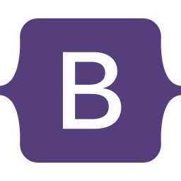
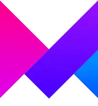

Hello! I’m Youssef Amin Raeis

A Front-End Developer crafting engaging user experiences

About Me

I’m a passionate front-end developer specializing in building dynamic, responsive, and interactive web applications. With a keen eye for design and detail, I love turning ideas into functional and visually stunning projects. I’m always excited to tackle challenges, learn new technologies, and push the boundaries of what’s possible in web development.

	“They call us dreamers, but we’re the ones that don’t sleep.”

🛠 Tech Stack & Skills

Languages & Frameworks:
	•	HTML | CSS | JavaScript | React
	•	Tailwind CSS | Bootstrap | SCSS

Tools & Libraries:
	•	Framer Motion | Git | GitHub

Key Expertise:
	•	Front-End Development
	•	Responsive Design
	•	Animations & Interactivity
	•	Version Control

💼 Featured Projects

Brainwave: Next-Level UI/UX Website

A cutting-edge web design project built with React and Tailwind CSS, featuring sleek animations powered by Framer Motion.

	Explore how style meets functionality in this modern, interactive website.

Metaverse Experience

Dive into the future with this immersive Next.js project.

	Packed with animations and responsive design, it brings the Metaverse to life.

	Check out more of my work on my GitHub profile.

Contact Me
	•	📞 Phone: +20 10 155200 12
	•	📧 Email: raeis.pro@outlook.com
	•	🔗 LinkedIn: Connect with me

I’m always open to new opportunities and collaborations—let’s create something amazing together!

    
    
    
    
    
    
    
    

  
